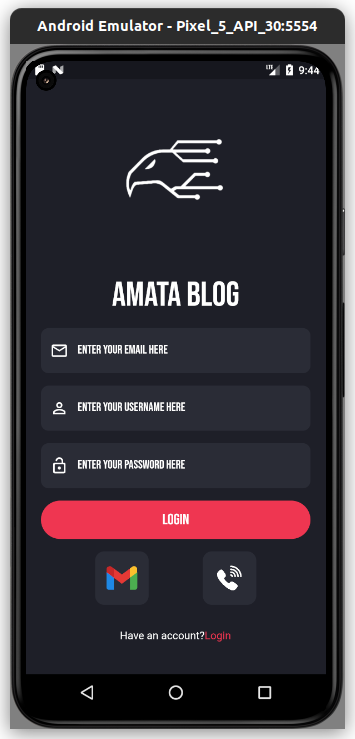

# Amata Blog
## simple blog application with flutter and firebase 
### screenshots

## what is Amata Blog?
### amata blog is a application witch enable its users to read and save article and in future will be able to write article into it.

---
## supported platforms

---
## TechStack

---
## Packages Used
    - flutter_bloc
    - beamer
    - firebase packages
    - flutter_svg
    - cached_network_image
## Architecture used:  Bloc pattern
---
## How to contribute on this project?
### 1. create fork of project 
### 2. clone project and open it by your own ide
### 3. make changes then push it to your copy repository
### 4. create pull request to our repository
